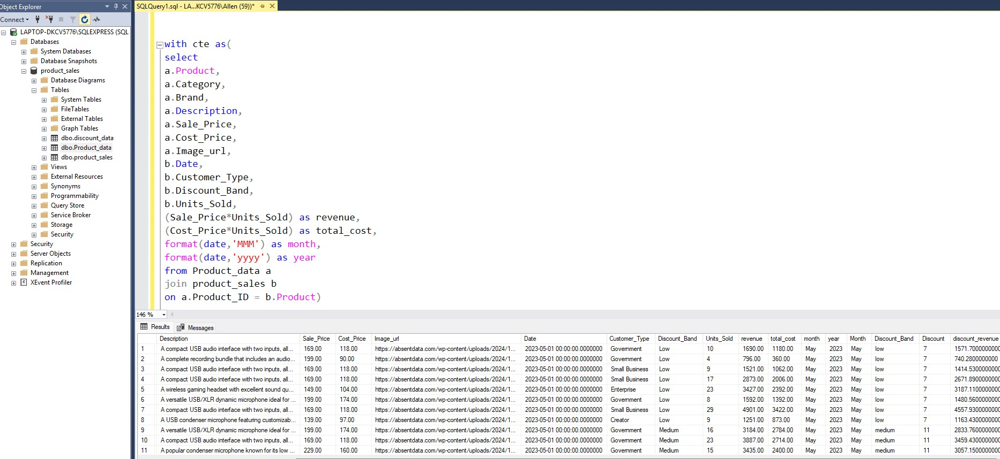

# 📦 ASCeS Sound Product Sales Analysis (SQL + Power BI Project)

## 📌 Overview

This project showcases an end-to-end data analysis solution for ASCeS Sound’s product sales using SQL Server and Power BI. The goal was to generate insights into product performance, revenue trends, and discount impacts through a structured database and dynamic dashboard.

---

## 🎯 Objectives

- Analyze sales data to identify product performance trends
- Evaluate discount effectiveness across time periods and product categories
- Deliver clear, visual insights through interactive dashboards using Power BI
- Integrate SQL queries and Power BI for seamless end-to-end data analysis
- Provide actionable recommendations to ASCeS based on insights derived from the data

---

## 📐 Project Tasks

1. **Design and Build a Relational Database**  
   Normalized data across multiple CSVs into a structured schema.

2. **Develop SQL Queries for Analysis**  
   Created analytical queries to calculate discount revenue, monthly trends, and product metrics.

3. **Connect Power BI to SQL Server**  
   Established a live connection and imported query results into Power BI.

4. **Design Interactive Dashboards**  
   Built visual reports showing product sales, revenue, discount impact, and top-performing bands.

---

## 🗄️ Dataset Files

The following raw datasets were used to build the database and perform analysis. All files are located in the [`/data`](./data) folder:

| File                                            | Description                                                            |
| ----------------------------------------------- | ---------------------------------------------------------------------- |
| [`product_sales.csv`](./data/product_sales.csv) | Transactional sales records, including revenue and product identifiers |
| [`Product_data.csv`](./data/Product_data.csv)   | Product metadata including names, categories, and price points         |
| [`discount_data.csv`](./data/discount_data.csv) | Monthly discount bands and corresponding discount rates                |

---

## 🧠 Sample SQL Query Used

> This query calculates `discount_revenue` by joining product and discount data using band and month values.

---

## 📊 Power BI Dashboard

> 📌 _Dashboard includes KPIs like revenue by product, profit (monthly and yearly), sales trends, top-performing bands, and discount performance insights._

- 🔗 [**View Live Dashboard**](https://app.powerbi.com/groups/me/reports/544de236-a759-4944-aaa6-6b83d74a83f7/83945a808025c532c7ed?experience=power-bi)
- 🔽 [**Download Power BI Report (.pbix)**](./Asces%20Sales%20Dashboard.pbix)

---

## ⚠️ Challenges & Resolutions

### Challenge 1: Data Aggregation from Multiple Sources

The sales, product, and discount data were stored separately and needed to be linked to extract meaningful insights.

**Resolution:**  
Used SQL joins to combine tables based on `Discount_Band` and `Month` to calculate adjusted revenue and discount performance.

---

### Challenge 2: Data Cleaning & Formatting

Some data inconsistencies and formatting issues affected visualization accuracy in Power BI.

**Resolution:**  
Cleaned and transformed data using **Power Query Editor**, ensured consistent data types, handled nulls, and reshaped tables for better analysis.

---

### Challenge 3: Year-on-Year Profit Calculations

Comparing profits across years required additional logic and transformation.

**Resolution:**  
Created calculated columns and measures using **DAX** to compute Year-over-Year (YoY) Profit and visualize growth trends over time.

---

## 🔍 Recommendations

Based on the insights generated from the Power BI dashboard:

1. **Reevaluate Discount Strategies**  
   High discount bands reduce revenue significantly. Consider smaller, targeted discounts to optimize profitability.

2. **Focus on High-Performing Product Bands**  
   Allocate marketing resources to bands that consistently outperform others in sales and revenue.

3. **Improve Seasonal Planning**  
   Identify monthly performance peaks and align inventory, promotions, and sales strategies accordingly.

4. **Bundle Low-Performing Products**  
   Increase the visibility of underperforming products through bundling or targeted campaigns.

5. **Add Regional/Channel-Level Analysis in Future**  
   Enhance the analysis with regional dimensions or customer segments for more granular insights.

---

## 🛠️ Tools & Technologies Used

| Tool                 | Purpose                                      |
| -------------------- | -------------------------------------------- |
| **Excel**            | Raw data storage and schema development      |
| **SQL**              | Database creation, storage, and querying     |
| **Power BI Desktop** | Data visualization and interactive dashboard |
| **Power Query**      | Data cleaning and transformation             |

---

## ✅ Outcomes

- Gained hands-on experience in SQL-Power BI integration
- Delivered actionable insights from raw CSV data
- Applied ETL processes, DAX measures, and interactive dashboard design
- Strengthened data storytelling and decision support capabilities
